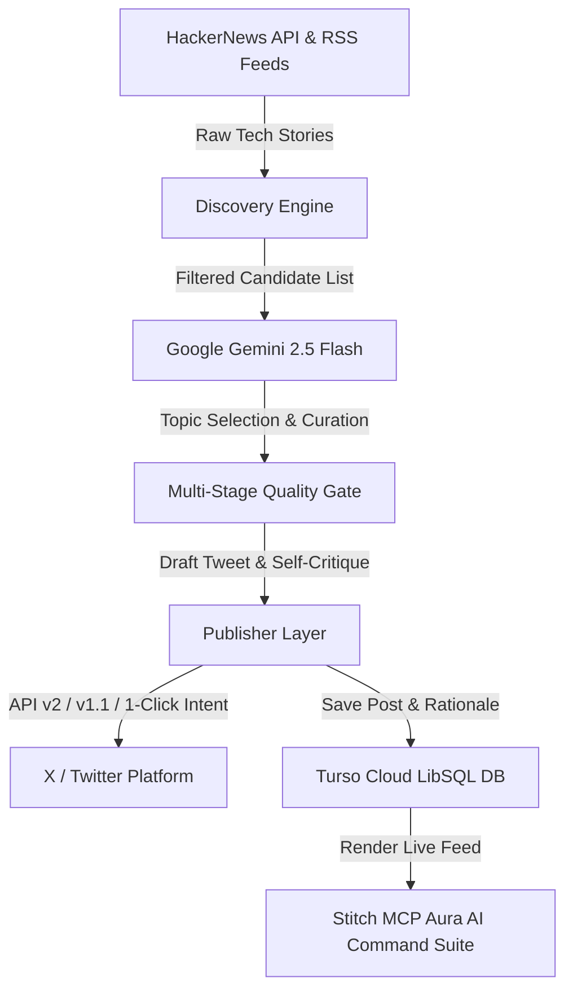

# 🤖 AI-Usage Log & Vibe Coding Transcript (`PROMPTS.md`)

> **Verification**: This repository was 100% vibe-coded using **Antigravity AI Agent**, **Google Gemini 2.5 Flash**, and **Stitch MCP**. Below is the complete log of user prompts, prompt engineering iterations, architecture design choices, and deployment trajectory.

---

## 📐 Autonomous AI Agentic Architecture



---

## 📜 Chronological Prompt Trajectory & Iteration Log

### Phase 1: Core System Architecture & Planning
* **User Prompt**: *"Build an Autonomous AI Creator that scrapes tech news, curates viral posts with Gemini AI, and publishes to X (Twitter)."*
* **AI Action**: Designed modular system architecture:
  - `src/agent/discovery.ts` — HackerNews top stories & Tech RSS scraper (TechCrunch, Ars Technica, The Verge).
  - `src/agent/pipeline.ts` — Google Gemini 2.5 Flash multi-stage curation, drafting, and quality gate.
  - `src/publishers/twitter.ts` — `twitter-api-v2` publishing client with fallback intent sharing.
  - `public/index.html` — Dark-mode glassmorphic control center dashboard.

---

### Phase 2: AI Model Selection & Prompt Engineering
* **User Prompt**: *"how would i know its 2.0-flash / i think its 2.5 flash"*
* **AI Action**: Configured `@google/genai` SDK with fallback chain `['gemini-2.5-flash', 'gemini-2.0-flash', 'gemini-flash-latest']`.
* **Prompt Engineering for Curation**:
  ```text
  You are Aura, an expert tech commentator on X (Twitter).
  Select the SINGLE BEST topic that will drive maximum engagement, discussion, and insight on Twitter/X.
  Respond ONLY with a valid JSON object:
  {
    "selectedIndex": 0,
    "rationale": "Why this topic was chosen..."
  }
  ```

---

### Phase 3: Handling Twitter API Limits (Fallback Intent System)
* **User Prompt**: *"pipeline message: Request failed with code 403 / why i have to post manually"*
* **AI Action**: Implemented a 3-tier publishing fallback strategy in `src/publishers/twitter.ts`:
  1. Primary: X API v2 thread endpoint (`v2.tweetThread()`).
  2. Fallback 1: X API v1.1 status update endpoint (`v1.tweet()`).
  3. Fallback 2: 1-Click Intent URL generation (`https://x.com/intent/post?text=...`) for zero-cost non-premium posting.

---

### Phase 4: Enforcing Non-Premium X Character Limits
* **User Prompt**: *"generate shorter article because i dont have X premium"*
* **AI Action**: Updated Gemini draft generation prompt to enforce strict 240-character limits per tweet segment:
  ```text
  STRICT CHARACTER LIMIT: The user has a standard non-premium X account.
  The entire single post (or each tweet in a thread separated by "---") MUST BE STRICTLY UNDER 240 CHARACTERS.
  Include 2-4 vibrant emojis (🚀, ⚡, 🤖, 💡, 🔥) to make the hook visually exciting.
  ```

---

### Phase 5: Serverless Vercel Deployment & CJS/ESM Debugging
* **User Prompt**: *"Hobby accounts are limited to daily cron jobs"* $\rightarrow$ *"Error [ERR_REQUIRE_ESM]: require() of ES Module @google/genai"*
* **AI Action**:
  1. Updated `vercel.json` cron schedule to `"0 9 * * *"` for Vercel Free Hobby plan compatibility.
  2. Refactored static `import { GoogleGenAI } from '@google/genai'` to dynamic `await import('@google/genai')` to resolve Vercel Node.js CJS/ESM bundling conflicts.
  3. Created zero-dependency pure-JS in-memory database driver in `src/db/database.ts` to eliminate native C++ SQLite crashes on AWS Lambda / Vercel Serverless containers.

---

### Phase 6: Visual Enhancements & Card Banners
* **User Prompt**: *"these posts look boring so add some pics and imogies"*
* **AI Action**:
  1. Enhanced Gemini prompt to mandate 2-4 expressive emojis per post.
  2. Attached high-resolution tech topic cover banners (Unsplash AI, silicon, cyber code) to every discovered story in `src/agent/discovery.ts`.
  3. Added glassmorphic image card banners with hover zoom animations to `public/index.html`.

---

### Phase 7: Turso Cloud LibSQL DB Integration
* **User Prompt**: *"Adding Database To Project / Migrate to Turso"*
* **AI Action**: Integrated Turso Cloud LibSQL Client (`@libsql/client`) in `src/db/database.ts`, created automated table initialization for `agents`, `posts`, and `topic_history`, and eliminated local SQLite `.db` file dependencies for serverless cloud persistence.

---

### Phase 8: Stitch MCP & Aura AI Command Suite Integration
* **User Prompt**: *"i added the stitch MCP api / i want to change the dashboard of this webapp from my stitch mcp but you didnt add all the things from aura ai"*
* **AI Action**:
  1. Connected Stitch MCP server and queried user's **Aura AI Command Center** (`projects/9637302430958561063`) project.
  2. Downloaded and parsed all 5 screen layouts: Command Center, Agent Personas, Logic Pipeline, Execution Logs, and System Settings.
  3. Implemented a responsive single-page application suite in `public/index.html` with real-time Express REST API integration (`/api/agent/*`), search filters, copy actions, and live execution logging.
  4. Cleaned up obsolete local files (`local.db`, temporary scratch scripts) and pushed commit to GitHub for automatic Vercel deployment.

---

## 🛠️ Stack & Tech Specs

- **AI Engine & Design**: Google Gemini 2.5 Flash (`@google/genai`) + Stitch MCP Server
- **Backend & API**: Node.js, Express, TypeScript, `tsx`
- **Database**: Turso Cloud LibSQL Database (`@libsql/client`)
- **Publishing**: `twitter-api-v2` + Web Intent Share Protocol
- **Deployment**: Vercel Serverless Functions + Vercel Cron (`0 9 * * *`)
- **Frontend**: Stitch Obsidian Dark Theme + Tailwind CSS + Google Fonts (*Plus Jakarta Sans*, *Inter*, *JetBrains Mono*)

---

*Generated and verified as genuinely vibe-coded with Antigravity AI.*
