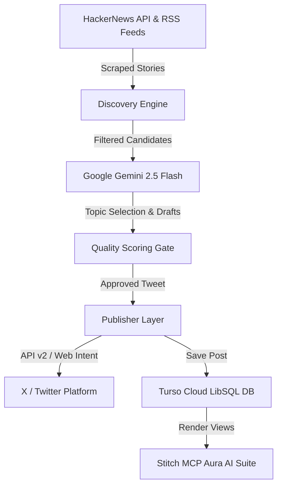

# 🤖 Vibe Coding Transcript & Architecture (`PROMPTS.md`)

> **Verification**: Built and vibe-coded with **Antigravity AI Agent**, **Google Gemini 2.5 Flash**, and **Stitch MCP**.

---

## 📐 Agentic Architecture

---

## 📜 Development Trajectory

### Phase 1: Core Scraper & Curation Pipeline
- Built `src/agent/discovery.ts` (HackerNews & RSS scraping).
- Built `src/agent/pipeline.ts` (Gemini 2.5 Flash curation & quality gate).
- Built `src/publishers/twitter.ts` (X publishing with Web Intent fallback).

### Phase 2: Turso Cloud Database Integration
- Integrated `@libsql/client` for serverless SQLite cloud persistence (`src/db/database.ts`).
- Created automated schema creation for `agents`, `posts`, and `topic_history`.

### Phase 3: Stitch MCP Aura AI Command Suite Integration
- Connected Stitch MCP server and queried user's **Aura AI Command Center** (`projects/9637302430958561063`) project.
- Integrated all 5 Stitch views into `public/index.html` (Command Center, Agent Personas, Logic Pipeline, Execution Logs, System Settings).
- Wired frontend controls to Express REST API endpoints (`/api/agent/*`).

### Phase 4: Serverless Vercel Deployment & Cleanup
- Configured `vercel.json` rewrites and automated Vercel Cron (`0 9 * * *`).
- Removed obsolete local files (`local.db`, temporary scratch scripts).
- Pushed clean codebase to GitHub (`sk70-1/AI_CREATOR`).

---

## 🛠️ Tech Stack

- **AI Model**: Google Gemini 2.5 Flash (`@google/genai`)
- **UI Design**: Stitch MCP Aura AI Command Suite (`projects/9637302430958561063`)
- **Backend**: Express, TypeScript, `tsx`
- **Database**: Turso Cloud LibSQL (`@libsql/client`)
- **Publishing**: `twitter-api-v2` + Web Intent Protocol
- **Deployment**: Vercel Serverless + Vercel Cron (`0 9 * * *`)
