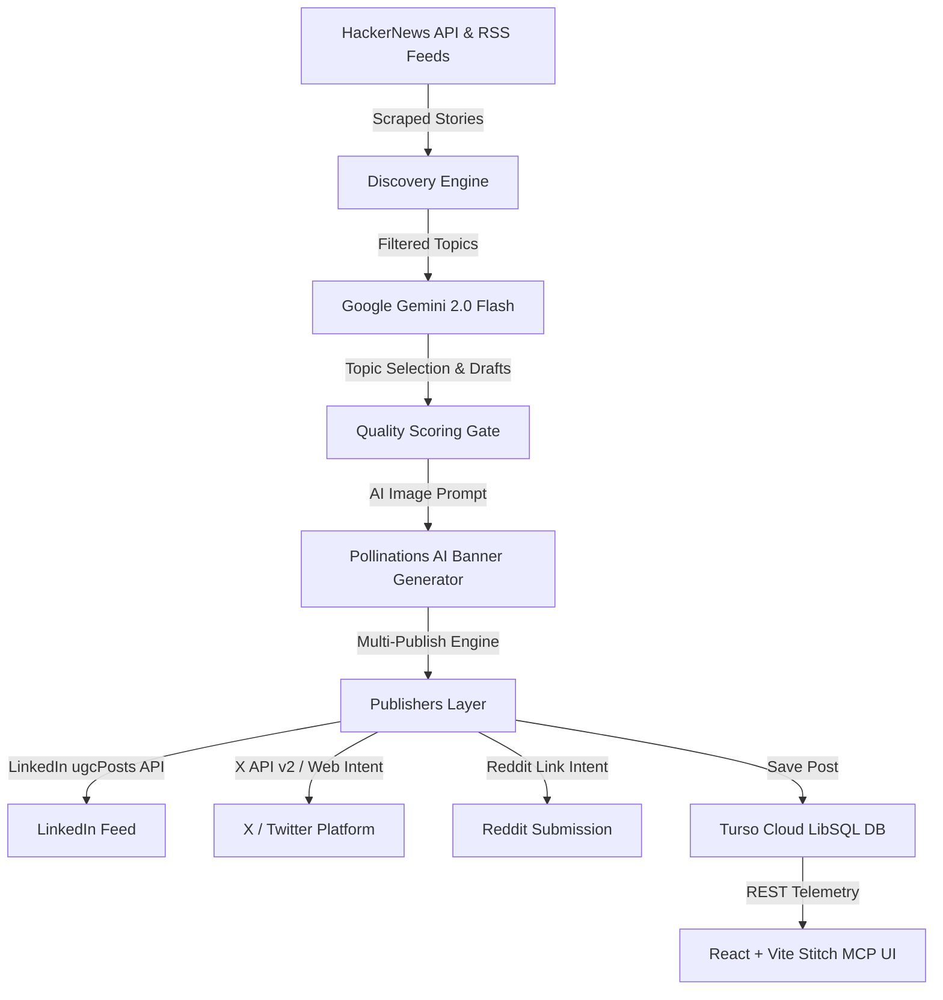

# 🤖 Agentic Architecture & System Specs (`PROMPTS.md`)

> **Verification**: Built & vibe-coded with **Antigravity AI Agent**, **Google Gemini 2.0 Flash**, and **Google Stitch MCP**.

---

## 📐 System Architecture

---

## 📜 Development Trajectory

### Phase 1: Discovery & Gemini Curation Engine
- Built `src/agent/discovery.ts` (HackerNews API & RSS scraper with 5s timeouts).
- Built `src/agent/pipeline.ts` (Gemini 2.0 Flash curation, persona tone drafting, and 9.5/10 Quality Gate).

### Phase 2: AI Cover Graphics & Database Persistence
- Integrated Pollinations AI banner generator for 3D neon obsidian topic cover graphics.
- Connected `@libsql/client` HTTP client (`src/db/database.ts`) for serverless cloud persistence across `agents`, `posts`, and `topic_history`.

### Phase 3: Stitch MCP React UI & Responsive Layout
- Built modular React + TypeScript dashboard (`src/frontend/components/`) matching Google Stitch design system specs.
- Fixed sidebar layout with desktop sticky flex column and mobile slide-over backdrop drawer.

### Phase 4: Multi-Platform Publishing & Vercel Serverless
- Built `src/publishers/linkedin.ts` (LinkedIn `ugcPosts` API & automated member URN resolution).
- Configured Vercel serverless function (`api/index.ts`), SPA rewrites, and daily Vercel Cron (`0 9 * * *`).

---

## 🛠️ Technology Stack

- **Frontend**: React 19, TypeScript, Vite, Tailwind CSS v4, Framer Motion, Lucide Icons
- **AI Core**: Google Gemini 2.0 Flash (`@google/genai`)
- **Backend API**: Express 4, Node.js (`tsx`)
- **Database**: Turso Cloud LibSQL (`@libsql/client`)
- **Publishers**: LinkedIn `ugcPosts` API + Twitter `twitter-api-v2` + Web Intent URLs
- **Hosting**: Vercel Serverless Functions + Vercel Cron (`0 9 * * *`)
